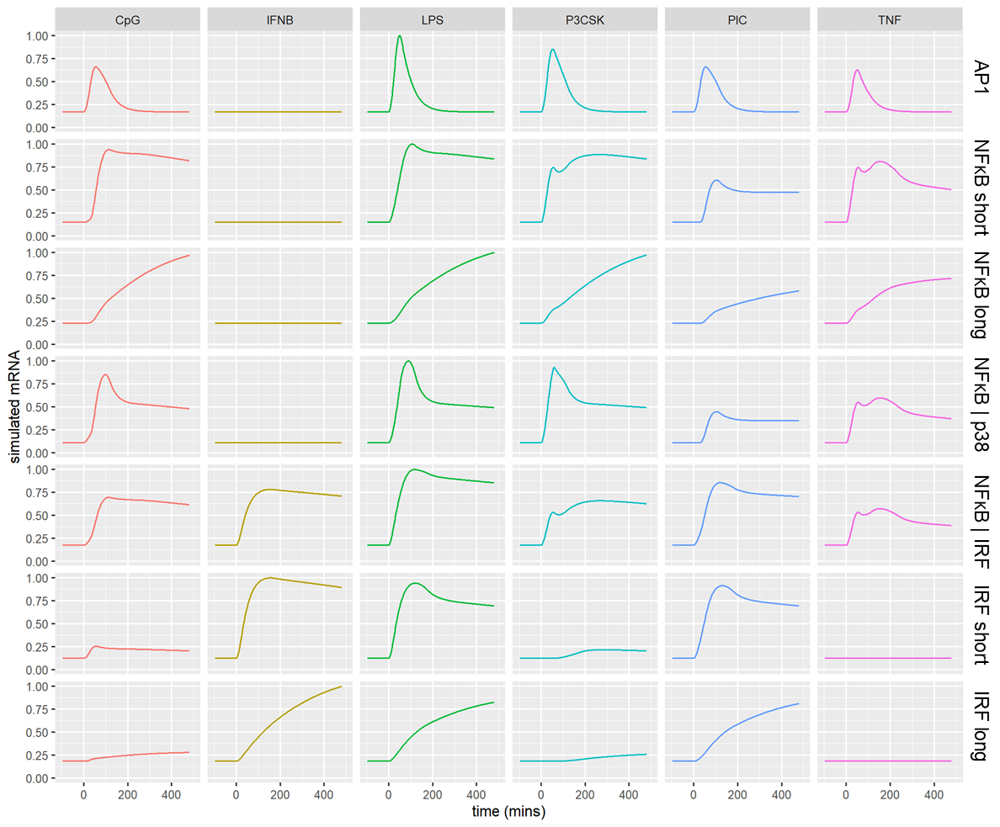

# ODE model-based Gene Assignments
Assignment of immune response genes to Gene Regulatory Strategies/Gene Regulatory Mechanisms (GRSs/GRMs)

This subfolder contains code for simulating mathematical models of macrophage GRMs, and assigning individual genes to the most likely GRM based on the gene expression pattern over six immune stimuli. Our initial assignments of gene regulatory strategies were obtained via knowledge gained from this data-driven approach. We examined time-series data of population averages across macrophages stimulated the six stimuli. Using EMSA and Western blot data of transcription factors and kinases as model input, we then simulated 7 known gene regulatory strategies (GRSs/GRMs) in the macrophage response (Cheng et al., 2017, Cell Systems). (The Cheng et al. GRMs “NFκB short mRNA half-life (HL)” and “NFκB long half-life” were compressed to NFκB in this paper; the same for IRF short mRNA half-life and long half-life). We calculated the RMSD for each gene when compared to the simulation of regulatory strategies, and assigned the one with lowest RMSD (as done in Cheng et al. for a different set of genes). 

TF/kinase activities used as input into the ODE models can be found in ./Cheng2017_TableS2inputs. The ODEs for the seven GRSs are as follows, for AP1, NFκB short HL, NFκB long HL, NFκB|p38, NFκB|IRF, IRF short HL, IRF long HL. All other parameters are specified in the script assign_model.R and further described in Cheng et al., 2017.
```math
      dG1S <-kdg1s*fA-kdg1s*G1S #mA (AP1)
      dG2S <-kdg2s*fN-kdg2s*G2S #mB (NFκB short HL)
      dG2L <-kdg2l*fN-kdg2l*G2L #mC (NFκB long HL)
      dG10L <-kdg2s*fN-kdg10l*G10L #mD, mod.2S (NFκB|p38)
      dG7S <-kdg7s*fIN-kdg7s*G7S #mE (NFκB|IRF)
      dG3S <-kdg3s*fI-kdg3s*G3S #mF (IRF short HL)
      dG3L <-kdg3l*fI-kdg3l*G3L #mG (IRF long HL)
```

where fA, fN, fI, and fIN are logic gates for transcription factor acitivities at the promoter. 
```math
	#single gates
	fA<-(1.0-k0)*((ktA*ap1)^n/(1.0+(ktA*ap1)^n))+k0
	fN<-(1.0-k0)*((ktN*nfkb)^n/(1.0+(ktN*nfkb)^n))+k0
	fI<-(1.0-k0)*((ktI*irf)^n/(1.0+(ktI*irf)^n))+k0

	#OR gate
	fIN<-(1.0-k0)*(((ktN*nfkb)^n+(ktI*irf)^n+(ktN*ktI*nfkb*irf)^n)/(1.0+(ktN*nfkb)^n+(ktI*irf)^n+(ktN*ktI*nfkb*irf)^n))+k0
```

Simulating these GRSs and normalizing to max across all stimuli results in distinctive gene expression patterns for each GRS, and the best match assigned to individual genes. 

